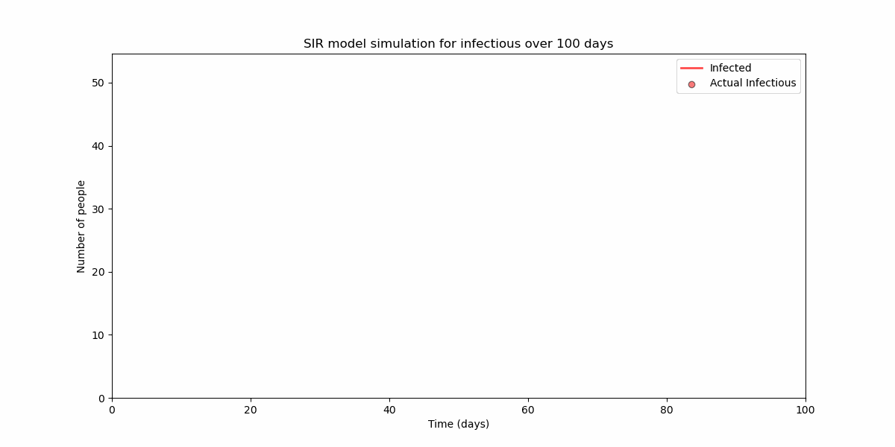

# COVID-19 Transmission Dynamics: An SIR Model Analysis

## Overview
This Jupyter notebook presents a detailed analysis of COVID-19 transmission dynamics in using the SIR (Susceptible, Infected, Recovered) model. The SIR model is a classical mathematical framework in epidemiology used to predict the spread of infectious diseases. By applying this model, the study aims to understand and simulate the progression of the COVID-19 pandemic.

## Objective
The primary objective of this research is to examine the dynamics of COVID-19 transmission using the SIR model. The analysis focuses on utilizing COVID-19 case data and applying data manipulation techniques through Python's Pandas library.

## Data Source
The study analyzes COVID-19 case data: https://github.com/datasets/covid-19. The data manipulation and analysis are performed using the Pandas library, a powerful tool for data analysis and manipulation in Python.

## Model Description
The SIR model divides the population into three distinct groups:
- **Susceptible (S):** Individuals who are susceptible to the infection.
- **Infected (I):** Individuals who are currently infected.
- **Recovered (R):** Individuals who have recovered from the infection.

The transitions between these states are governed by a set of differential equations, with `β` representing the rate at which the infection spreads from infected to susceptible individuals, `γ` denoting the recovery rate, and `N` being the total population.

$$\begin{align*}
\frac{dS}{dt} & = -\beta \frac{SI}{N}, \\
\frac{dI}{dt} & = \beta \frac{SI}{N} - \gamma I, \\
\frac{dR}{dt} & = \gamma I
\end{align*}$$

## Simulation
The study utilizes the `odeint` function from the SciPy library to solve the differential equations of the SIR model, enabling the simulation of the disease's progression over time.

## How to Run
To run this Jupyter notebook:
1. Ensure Jupyter Notebook or JupyterLab is installed on your system.
2. Install the required Python libraries, including Pandas and SciPy.
3. Download the notebook and the COVID-19 case data.
4. Open the notebook in Jupyter and execute each cell sequentially to reproduce the analysis and results.

## Requirements
This notebook requires the following Python libraries:
- Pandas
- SciPy
- Matplotlib (for data visualization)